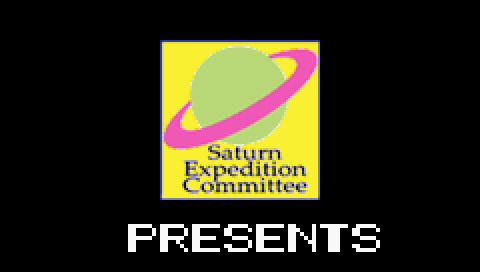

# WIISP

Emulador de PSP para Wii, **en desarrollo temprano**. El objetivo es que los
juegos sean jugables gracias a la emulación de alto nivel (HLE) del sistema
operativo, un dynarec MIPS→PowerPC basado en el de Wii64/Not64 y la traducción
de los gráficos de la PSP a GX. Ver [ARQUITECTURA.md](ARQUITECTURA.md).

## Estado

**Fase 2 completa.** WIISP carga un `EBOOT.PBP` (o ELF/PRX) y lo ejecuta con
un intérprete del Allegrex y HLE del sistema operativo de la PSP (hilos,
semáforos, memoria, archivos, pantalla, mandos). Los homebrew sencillos que
dibujan en el framebuffer ya se ven. Todavía no hay VFPU ni gráficos 3D (GE).

Al cargar un juego escribe `imports.txt` junto al EBOOT: la lista de funciones
del firmware que usa y cuáles ya implementa WIISP.



## Compilar para Wii

Requiere [devkitPro](https://devkitpro.org/wiki/Getting_Started) con devkitPPC
y libogc (paquete `wii-dev`).

```sh
make dist
```

Copia `dist/apps` a la raíz de la SD y pon el `EBOOT.PBP` de un homebrew de PSP
sin cifrar junto al `boot.dol` (`sd:/apps/wiisp/EBOOT.PBP`). También se busca
en `sd:/wiisp/` y en USB. Después abre WIISP desde el Homebrew Channel.

El zip de GitHub Actions ya trae un `EBOOT.PBP` de prueba (sintético) en
`apps/wiisp/` para comprobar que todo funciona.

Cada push también compila el `.dol` en GitHub Actions; se descarga desde la
pestaña *Actions* (artefacto `wiisp-wii`).

## Compilar y probar en PC

```sh
make -f Makefile.pc                  # build-pc/wiisp-cli
./build-pc/wiisp-cli --all EBOOT.PBP # muestra módulo, imports y NIDs
./build-pc/wiisp-cli --run --screenshot pantalla.ppm EBOOT.PBP
./build-pc/wiisp-cli --imports imports.txt EBOOT.PBP
make -f Makefile.pc test             # pruebas (ASan + UBSan)
make -f Makefile.pc test-ppc         # pruebas en PowerPC big-endian (qemu)
```

`test-ppc` necesita `gcc-powerpc-linux-gnu` y `qemu-user`.

Pruebas con programas reales de PSP ([pspautotests](https://github.com/hrydgard/pspautotests)):

```sh
git clone https://github.com/hrydgard/pspautotests ../pspautotests
python3 tests/autotests.py ../pspautotests --list tests/autotests_pass.txt  # los que deben pasar
python3 tests/autotests.py ../pspautotests threads/ -v                      # una carpeta, con diffs
```

## Licencia

GPLv2 o posterior (ver [LICENSE](LICENSE)). Incluye material de referencia de
Wii64/Not64 (© Mike Slegeir y colaboradores, GPLv2+).
